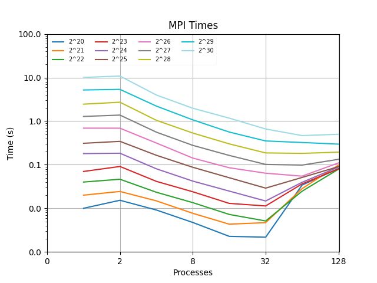
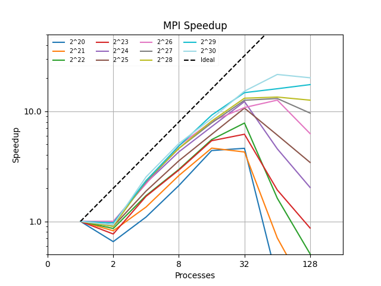

# PD 08

## Velocidad de ejecución en Paralelo
Calcule la velocidad de ejecución en paralelo (**en FLOPs**) para cada caso,
*e.g.* contabilizando las operaciones de coma flotante y dividiéndolas entre
el tiempo:

```c++
// NOTE: 5 floating point operations
double f(double x) {
  double pi = 3.141592653589793;
  double value;

  value = 50.0 / (pi * (2500.0 * x * x + 1.0));

  return value;
}
```
```c++
// NOTE: 10 * n floating point operations
for(i = 0; i < n; i++) {
  // NOTE: 4 floating point operations
  x = ((n - i - 1) * a + (i) * b) / (n - 1);
  // NOTE: 6 floating point operations
  total = total + f(x);
}
```

```c++
// NOTE: 4 floating point operations
total = (b - a) * total / (double) n;
error = fabs(total - exact);
```

Con lo presentado anteriormente tendríamos que el número de operaciones
en secuencial del código presentado es de `10 * N + 4` **FLOPs**.

### Velocidad en Paralelo

Teniendo en cuenta lo anteriormente presentado, podemos defir que, la velocidad
de ejecución en paralelo del código presentado es de `10 * N / P + 4` **FLOPs**
entre el tiempo de ejecución; donde `P` es el número de *threads* en las que se
ejecuta el código. Con lo presentado anteriormente tendríamos que la velocidad de
ejecución en paralelo del código presentado es de `(10 * N / P + 4) / t_exec` **FLOPs/s**.
Entonces se presenta la siguiente tabla de resultados variando P, para $N = 2^{30}$:

`Esta es una tabla referencial, teniendo en cuenta los valores de tiempo aproximados obtenidos`

| P | Tiempo(s) | Velocidad (FLOPs/s) |
|---|-----------|---------------------|
| 2 | 5 | 0.1074 * 10^10 |
| 4 | 3 | 0.0895 * 10^10 |
| 8 | 2 | 0.0671 * 10^10 |
| 16 | 1 | 0.0671 * 10^10 |
| 32 | 0.8 | 0.0420 * 10^10 |
| 64 | 0.5 | 0.0336 * 10^10 |
| 128 | 0.5 | 0.0168 * 10^10 |

## Principio de isoeficiencia

Como se puede deducir del código secuencial, $T_s = O(n)$. En cuanto al código en paralelo, en OMP $T_p = O(\frac{n}{p})$, mientras que en MPI $T_p = O(\frac{n}{p} + log(p))$, esto debido al tiempo de comunicación necesario en MPI. Por lo tanto, teóricamente, en OMP, $S=O(\frac{n}{\frac{n}{p}}) = O(p)$, por lo que la eficiencia $E=O(1)$ sería ideal. Por otro lado, en MPI, $S=O(\frac{n}{\frac{n}{p}+log(p)})$, y su eficiencia $E=O(\frac{1}{1 + \frac{plog(p)}{n}})$, lo que nos indica que, para obtener la eficiencia ideal, $n = O(plog(p))$.

Observando los resultados obtenidos en las gráficas siguientes; podemos comentar que, teniendo en cuenta el valor teórico de *OMP* se mantiene constante para los primeros valores experimentales de **NP**; sin embargo, los siguientes valores experimentales decrecen significativamente. Por otro lado, para *MPI*, comentando los valores experimentales obtenidos podemos decir que decrece muy rápido en eficiencia y se mantiene contante aproximadamente hasta valores menores a $32$, lo que puede sugerir que podemos esperar mejores resultados en ese rango de valores.

## Gráficas para la ejecución en Paralelo (MPI - OMP)
### 1. Presente los resultados en sendos graficos **t vs np**, **s vs np**.

Presentamos una gráfica de los tiempos de ejecución del algoritmo en con diferentes tamaños en **N** y diferentes números de procesos. El código para conseguir esto lo podemos ver en `experiments.bash`, donde se hace tienen valores para **N** de $[20 - 30]$ y **np** de $[1 - 7]$ cada uno con 10 repeticiones para evitar sesgos en las experimentaciones.

### Gráficos Tiempo *vs* Número de Procesos

En los siguientes gráficos mostrados podemos ver que los tiempos en segundos para $N = [20-26]$ tienen un tiempo de ejecución pequeño de 1 seg. comparado con los demás valores de **N** que superan este timepo por varios segundos. Este comportamiento se sigue repitiendo para los demás valores de **np** hasta llegar a 64 procesos donde se estabilizan en menos de 1 seg. Además podemos ver que en los últimos valores de **np** para los casos de N antes mencionados incrementan su tiempo de ejecución; mientras que los que superaban ese rango solo decresen. Esto lo vamos a ver menos en el análisis de eficiencia.



En constrante con lo anteriormente mencionado podemos que en la recta final el gráfico de OMP no incrementa su tiempo de ejecución para los últimos valores, esto posiblemente debido a que no tenemos valores de *tiempo de comunicación* significantes.


### Gráficos Speedup *vs* Número de Procesos

Como se pudo ver en teoría, el valor de speedup no alcanza el valor ideal y siempre se mantiene por debajo de la curva. Sin embargo, siguiendo la línea de pensamiento desarrollado previamente con las gráficas de tiempo, podemos precisar que es en el último tramo del gráfico donde podemos ver que para los valores grandes de **N** ($[27 - 30]$) es donde el *speedup* parece mantenerse creciendo con la recta, mientras que para los valores pequeños decrese en gran medida.



Asimismo, como en la gráfica de tiempo de OMP, podemos ver el speedup en OMP también se mantiene *estable* siguiendo en gran medida los valores propuestos en la recta de speedup ideal.


### Gráficos Eficiencia *vs* Número de Procesos

Como se pudo ver en teoría, el valor de *efficiency* no alcanza el valor ideal y siempre se mantiene por debajo de la curva. Sin embargo, para los valores de MPI podemos ver que decrecen demasiado rápido con los primeros valores de **NP**, esto bajo la idea de que se desperdician demasiados procesos desde el principio; ya que, decrese hasta $0.5$ aprox.  


Por otro lado, podemos ver que los valores de *efficiency* para OMP decresen constantemente mientras crecen el número de threads **NP**; sin embargo, observamos que se mantiene muy cerca de los valores ideales propuestos. Concluyendo así que no se desperdician muchas *threads* como se hace con los *procesos* en MPI.


## Conclusiones y escalabilidad

Observando los resultados experimentales y los análisis hechos, podemos decir que:

  - El algoritmo en tiene un buen desempeño con valores de $2 < NP < 32$, tanto en *speedup* y *efficiency* donde los valores obtenidos son aceptables ya que se acercan a los valores ideales propuestos o se mantienen constantes dentro de ese rango. Indicando algo de estabilidad con estos valores para casi todos los valores de **N** propuestos. Sin embargo, se demuestra que se desperdician muchos recursos tanto con MPI como OMP; ya que, la eficiencia decrece con velocidades diferentes en ambos casos pero demuestra que se están malgastando recursos en el algoritmo.

  - Por otro lado, podemos ver que los valores de tiempo decrecen para todos los valores de **N** y **NP**; por lo que, podemos decir que se logro acelerar el tiempo de cálculo del algoritmo propuesto. Donde teniendo en cuenta que los valores de **N** aumentaban exponencialmente podemos decir que puede escalar con valores de **N** más grandes, al menos en términos de tiempos de ejecución.